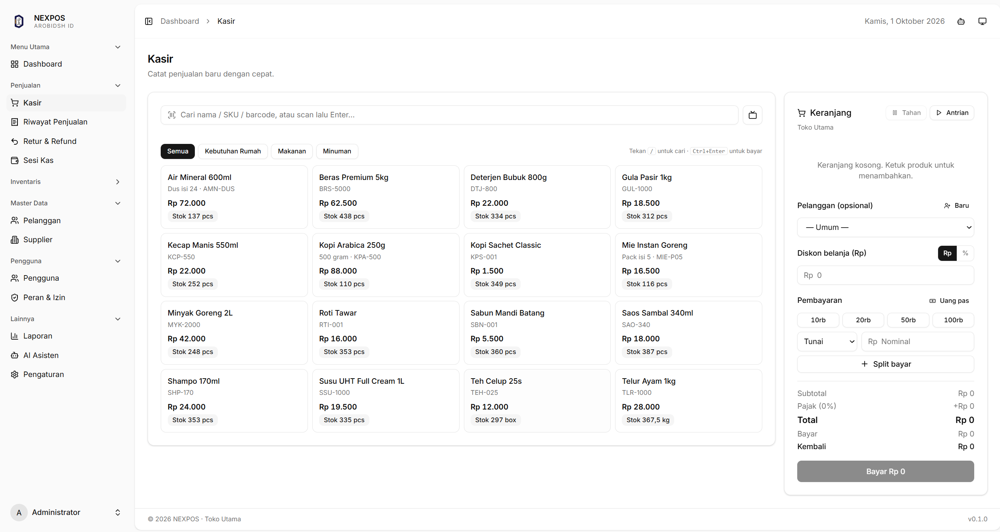
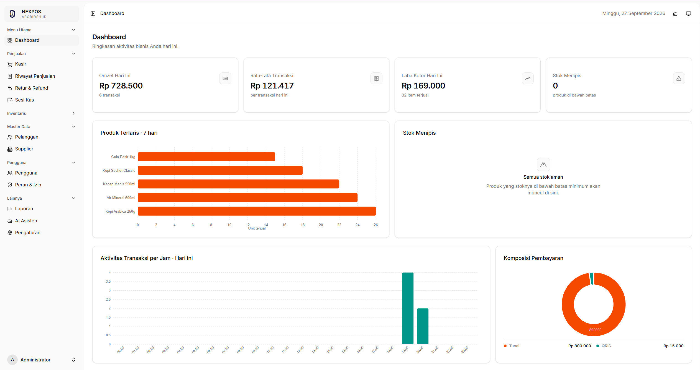
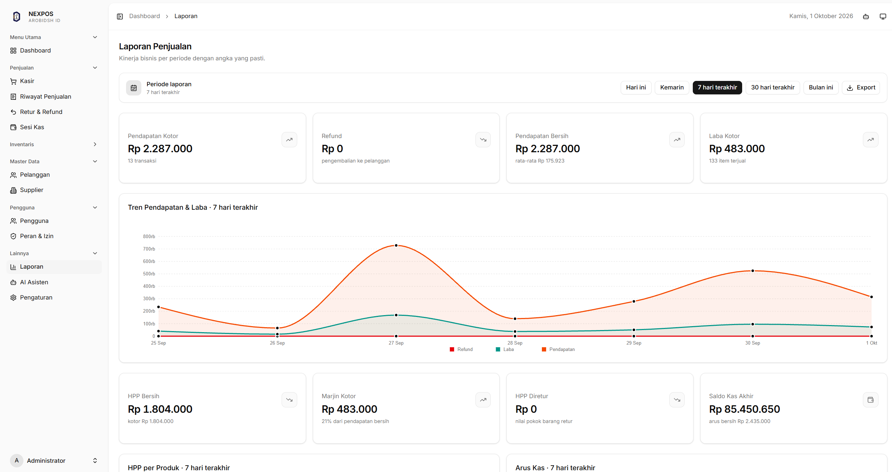
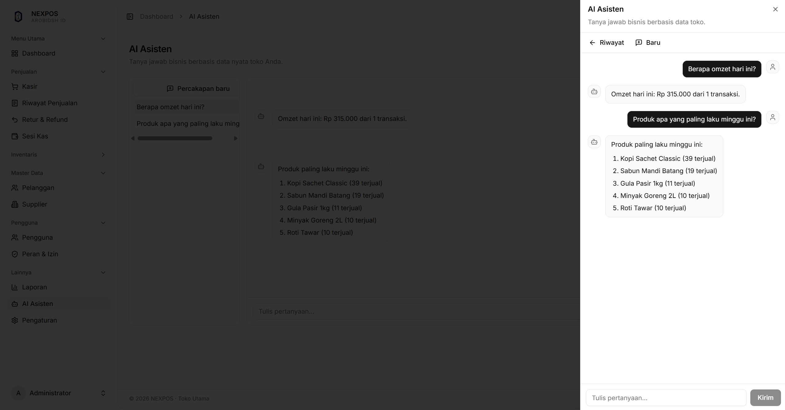
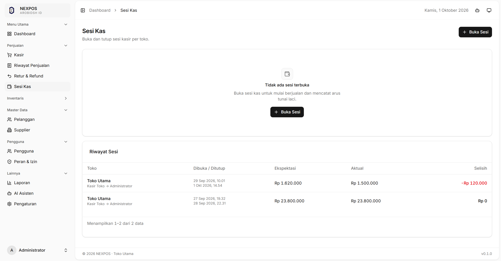
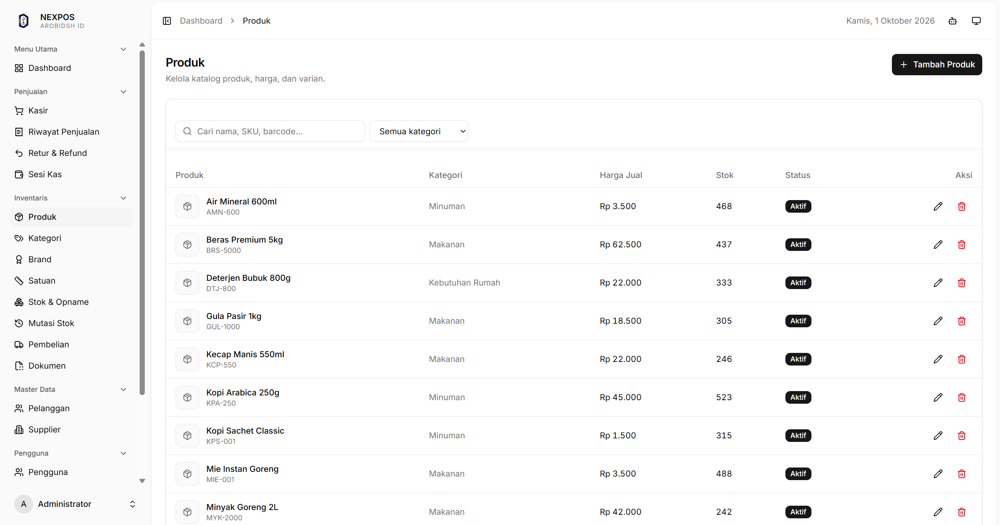

# NEXPOS

Platform **Point of Sale (POS)** dan business intelligence berbasis AI untuk
satu bisnis.

NEXPOS bukan aplikasi multi-tenant dan bukan SaaS. Laravel berperan sebagai
`source of truth` untuk business rules, authorization, validation, transaction,
inventory, financial calculation, dan eksekusi AI tool.

## Fitur Utama

- POS dengan pencarian barcode, cart, discount, split payment, kembalian, dan receipt.
- PWA kasir: installable, snapshot katalog offline, dan antrean checkout IndexedDB yang tersinkron otomatis (idempotent).
- Master data produk, variant, category, brand, unit, customer, supplier, dan store.
- Ledger-based inventory dengan purchase, stock adjustment, return, dan audit history.
- Pembelian dengan riwayat pembayaran bertanggal (`purchase_payments`) dan status hutang.
- Cash session dengan opening/closing balance, ekspektasi laci, selisih, dan halaman rekonsiliasi per sesi.
- Sales return dengan proportional refund dan pengembalian stok.
- Report dengan KPI, daily trend, produk terlaris, inventory value, dan chart.
- Laporan HPP (kotor, retur, bersih, marjin) per produk dan per hari.
- Laporan arus kas basis kas (masuk, keluar pemasok, refund, saldo awal/akhir) + tabel harian.
- Export CSV dan PDF (dompdf) untuk laporan harian, HPP, dan arus kas via satu dialog Export.
- Dokumen faktur dengan OCR antrean, verifikasi menjadi purchase, retry, dan reject.
- AI assistant berbahasa Indonesia menggunakan Ollama dan Qwen3.
- Deterministic AI business tool untuk sales, profit, HPP, arus kas, inventory, customer, purchase, dan report.
- Python ML service untuk forecasting, anomaly detection, recommendation, segmentation, dan OCR.
- Health endpoint (`GET /health`) untuk monitoring database, antrean, dan ML service.

## Preview

### Kasir POS



Cart, diskon, split payment, dan kembalian — tetap berjalan offline melalui antrean idempotent.

### Dashboard



Omset, laba, tren, produk terlaris, dan stok menipis dalam satu layar.

### Laporan HPP dan Arus Kas



HPP bersih, marjin kotor, dan arus kas basis kas dengan export CSV/PDF.

### AI Assistant



Tanya jawab Bahasa Indonesia di atas angka riil dari business tool — tanpa halusinasi.

### Rekonsiliasi Sesi Kas



Ekspektasi laci vs uang aktual per sesi, lengkap dengan selisihnya.

### Inventory/Product Management



Data produk yang dapat dikelola oleh Admin yang akan muncul up to date di halaman kasir

## Technology Stack

| Area | Teknologi |
| --- | --- |
| Backend | Laravel 13, PHP 8.3 |
| Frontend | React, TypeScript, Inertia.js v3, Tailwind CSS |
| UI dan chart | shadcn/ui, Lucide, Nivo |
| Database | PostgreSQL |
| Permission | Spatie Laravel Permission |
| PDF export | dompdf (server-side, tanpa browser) |
| LLM | Ollama dengan Qwen3 |
| ML service | Python, FastAPI, pandas, NumPy, scikit-learn, statsmodels |


LLM tidak pernah terhubung langsung ke database, mengeksekusi SQL, atau
menentukan authorization user. Laravel melakukan validation dan authorization
untuk setiap tool call. ML service menerima aggregated dataset dan mengembalikan
hasil komputasi; service ini tidak memiliki business authorization atau akses
database.

## Prasyarat

- PHP 8.3+
- Composer
- Node.js and npm
- PostgreSQL, atau SQLite untuk local setup yang ringan
- Python 3.10+ untuk ML service
- Ollama untuk AI chat dan AI-assisted analysis

Pengguna Windows dapat menjalankan project ini menggunakan Laragon.

## Quick Start

### Laravel Application

```powershell
git clone <repository-url>
cd nexpos

composer install
Copy-Item .env.example .env
php artisan key:generate

npm install
php artisan migrate --seed
npm run build
```

Akun administrator dari seeder:

```text
Email: admin@example.com
Password: password
```

Ganti password tersebut sebelum aplikasi digunakan di luar local development.

### Menjalankan Development Environment

```powershell
composer run dev
```

Laravel development server, queue worker, log process, dan Vite development
server dijalankan melalui Composer script project.

Jika ingin menjalankan setiap process secara terpisah:

```powershell
php artisan serve
npm run dev
php artisan queue:work
```

### Konfigurasi

Salin `.env.example` menjadi `.env`, lalu sesuaikan konfigurasi database.
Environment variable penting untuk local AI:

```dotenv
OLLAMA_URL=http://localhost:11434
OLLAMA_MODEL=qwen3:8b
OLLAMA_MODEL_FAST=qwen3:4b
OLLAMA_TIMEOUT=180

ML_URL=http://127.0.0.1:8001
ML_API_TOKEN=use-a-local-secret
ML_TIMEOUT=60
```

Jangan commit `.env`, API token, database credential, model file, atau database dump.

## Ollama

Install Ollama secara terpisah, lalu pull model yang dikonfigurasi di `.env`:

```powershell
ollama pull qwen3:8b
ollama pull qwen3:4b
```

Ollama bersifat optional untuk halaman POS dan report, tetapi wajib untuk
natural-language AI assistant.

## ML Service

ML service bersifat compute-only. Jalankan dari root repository:

```powershell
python -m venv ml\.venv
ml\.venv\Scripts\python.exe -m pip install -r ml\requirements.txt

$env:ML_API_TOKEN='use-the-same-value-as-.env'
ml\.venv\Scripts\python.exe -m uvicorn app:app `
    --host 127.0.0.1 --port 8001 --app-dir ml
```

Verifikasi bahwa service berjalan:

```powershell
Invoke-WebRequest http://127.0.0.1:8001/health
```

Endpoint yang tersedia:

| Endpoint | Fungsi |
| --- | --- |
| `GET /health` | Service health check |
| `POST /forecast` | Demand forecast |
| `POST /anomalies` | Revenue and transaction anomaly detection |
| `POST /recommend` | Product co-occurrence recommendations |
| `POST /segment` | RFM customer segmentation |
| `POST /ocr/invoice` | Invoice OCR |

Generate hasil ML dari Laravel setelah service berjalan:

```powershell
php artisan forecast:generate --queue
php artisan anomalies:scan --queue
php artisan recommend:generate --queue
php artisan customers:segment --queue
```

Tanpa `--queue`, command berjalan sinkron. Dengan `--queue`, pekerjaan masuk
antrean `ml` (sama seperti scheduler mingguan/harian) agar request dan
scheduler tidak terblokir oleh komputasi ML. Setiap eksekusi — antre maupun
sinkron — tercatat di tabel `ml_runs` (waktu, durasi, jumlah baris, error).

Pekerjaan latar lain:

```powershell
php artisan queue:work --queue=default,ml,ai,ocr
```

- `ocr`: ekstraksi faktur setelah upload dokumen (`documents.store`
  langsung mengantrekan `ProcessDocumentOcrJob`).
- `ai`: pemanasan `DailyBriefing` terjadwal tiap 05:30 agar dashboard instan.
- Dokumen gagal OCR dapat diantre ulang (`POST documents/{id}/retry`) atau
  ditolak (`POST documents/{id}/reject`).

Health probe untuk monitor/uptime:

```powershell
Invoke-WebRequest http://localhost:8000/health
```

Idempotency checkout: kirim header `X-Idempotency-Key` (atau field
`idempotency_key`) pada `POST pos/checkout` agar retry jaringan tidak
menciptakan transaksi ganda.

## PWA dan Offline Kasir

Halaman kasir (`/pos`) dapat di-install sebagai aplikasi (manifest +
ikon di `public/`) dan tetap dibuka saat internet putus: service worker
(`public/sw.js`, tanpa dependensi build) menyajikan shell dan snapshot
katalog terakhir.

Aturan offline:

- Katalog/harga/stok yang tampil diberi label waktu snapshot; harga dan
  stok final selalu mengikuti server saat transaksi dikirim.
- Checkout offline masuk antrean IndexedDB (`idempotency_key` dibuat
  sekali di kasir) dan dikirim otomatis FIFO saat online — retry tidak
  menciptakan transaksi ganda.
- Konflik server (stok kurang, sesi ditutup) berstatus `conflict` dan
  wajib ditinjau kasir: muat kembali ke kasir atau hapus. Tidak ada
  transaksi yang diam-diam hilang.
- Tutup sesi kas wajib online. Layar pembeli memakai BroadcastChannel
  (fallback: storage event + polling 2 detik).

Regenerasi ikon setelah ganti logo:

```powershell
ml\.venv\Scripts\python.exe scripts\gen-pwa-icons.py
```

## Built-in Role

| Role | Ruang lingkup |
| --- | --- |
| `admin` | Akses penuh ke aplikasi |
| `manager` | Business operation, report, dan AI; tanpa akses user dan settings management |
| `cashier` | POS, product, inventory viewing, sales, customer, dan AI |

Authorization ditegakkan melalui Laravel middleware, policy, dan form request.

## Testing dan Quality Check

Jalankan check paling spesifik saat development:

```powershell
php artisan test --compact tests/Feature/Reports/ReportTest.php
npm run types:check
```

Jalankan seluruh project check sebelum publish perubahan:

```powershell
php artisan test --compact
vendor/bin/pint --dirty --format agent
vendor/bin/phpstan analyse --no-progress
npm run types:check
npm run build
```

Gunakan `--dirty` pada Pint agar hanya file yang diubah yang diformat.

## Struktur Project

```text
app/              controller, model, policy, service, job, dan AI tool
app/Jobs/         antrean ML (ml), briefing (ai), dan OCR (ocr)
app/Support/      helper lintas service (mis. Money untuk Rupiah)
database/         migration, factory, dan seeder
docs/             panduan deployment produksi
lang/             terjemahan Bahasa Indonesia (mis. pesan login)
ml/               FastAPI ML service dan statistical workload
public/           sw.js, manifest, dan ikon PWA
resources/js/     Inertia React page, component, layout, lib, dan type
resources/views/  Blade untuk dokumen PDF (laporan)
routes/           web, settings, dan console route
scripts/          tooling dev (mis. generate ikon PWA)
tests/            Pest feature dan unit test
```

## License

Project ini saat ini dikelola sebagai portfolio dan development project.
